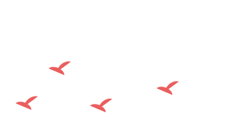
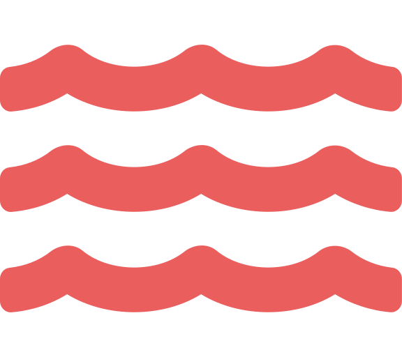
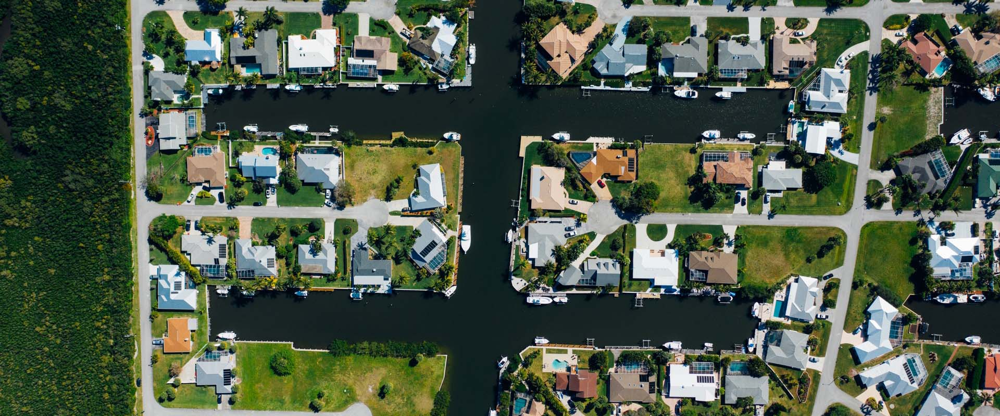

<!DOCTYPE html>
<html lang="en">

<head>
  <!-- Required meta tags -->
  <meta charset="utf-8">
  <meta name="viewport" content="width=device-width, initial-scale=1, shrink-to-fit=no">
  <link rel="icon" href="leaf.png">

  <!-- Title -->
  <title>Habitat Urbano</title>

  <!-- Bootstrap CSS -->
  <link rel="stylesheet" href="https://stackpath.bootstrapcdn.com/bootstrap/4.5.1/css/bootstrap.min.css" integrity="sha384-VCmXjywReHh4PwowAiWNagnWcLhlEJLA5buUprzK8rxFgeH0kww/aWY76TfkUoSX" crossorigin="anonymous">

  <!-- AOS CSS -->
  <link href="https://unpkg.com/aos@2.3.1/dist/aos.css" rel="stylesheet">

  <!-- CSS -->
  <link rel="stylesheet" href="css/styles.css">

  <!-- Icons -->
  

  <!-- Google fonts -->
  <link href="https://fonts.googleapis.com/css2?family=Josefin+Slab:wght@100;300;400;600;700&display=swap" rel="stylesheet">
  <link href="https://fonts.googleapis.com/css2?family=Montserrat:wght@100;200;300;400;500;600;700;800;900&display=swap" rel="stylesheet">
</head>

<body>

  <!-- MAIN CONTAINER -->
  

    <!-- NAVIGATION BAR -->
    <section id="NAVIGATION" class="col-12 no-nothing">
      <nav class="navbar navbar-expand-lg navbar-dark">
        <a class="navbar-brand" href="#INTRO"> HÁBITAT URBANO </a>
        <button class="navbar-toggler ml-auto" type="button" data-toggle="collapse" data-target="#navbarNav" aria-controls="navbarNav" aria-expanded="false" aria-label="Toggle navigation">
          
          <!-- CAMBIAR ICONO DEL TOGLER POR EL HEXA Y ANIM -->
        </button>
        

        

        

          <ul class="navbar-nav ml-auto">
            <li class="nav-item">
              <a class="nav-link" href="#ABOUT-US">QUIÉNES SOMOS</a>
            </li>
            <li class="nav-item">
              <a class="nav-link" href="#SOLUCIONES">SOLUCIONES</a>
            </li>
            <li class="nav-item">
              <a class="nav-link" href="#">CONTACTO</a>
            </li>
            <li class="nav-item">
              <a class="nav-link" href="#INTRO">ENG</a>
            </li>
          </ul>
        

      </nav>
    </section>
    <!-- END OF NAVIGATION BAR -->
    <!-- //////////////////////////////////////////////////////////////////// -->
    <!-- INTRO CONT -->
    <article id="INTRO" class="container-fluid no-nothing">
      

        

          
          <h1 class="title ml-auto mr-auto display-3 text-shadow-pop-bottom">HÁBITAT URBANO</h1>
          <h2 class="sub-title">Asesoramiento Ambiental</h2>
          <button class="btn btn-danger btn-danger-intro btn-lg" type="button" name="button">Contactanos</button>
        

      

    </article>
    <!-- END INTRO CONT -->
    <!-- //////////////////////////////////////////////////////////////////// -->
    <!-- ABOUT US SECTION -->
    <!-- INTRO ABOUT US -->
    <article id="ABOUT-US" class="about-us container-fluid no-nothing shadow-lg">
      

        

        

        

          <h1 class="about-us-intro-title display-4">Lorem Ipsum</h1>
          
Lorem ipsum dolor sit amet, consectetur adipiscing elit. Vivamus a sem a enim sollicitudin interdum. Nam convallis porttitor sapien, et fringilla sem iaculis in. Cras pellentesque, libero id ultrices rhoncus, odio tellus ultrices quam,
            nec dapibus ipsum nisl et orci. Integer faucibus lorem sed nulla lacinia consectetur. Ut vel enim quis lorem fringilla consectetur at non metus. Nullam molestie ante metus, ac viverra enim cursus nec. Ut sed arcu feugiat, venenatis turpis
            id, semper nisl. Cras magna massa, vulputate in porttitor eu, laoreet non est. Sed aliquam purus a elementum gravida.

        

        

      

      <!-- <svg id="bigTriangleColor" class="separator-1" xmlns="http://www.w3.org/2000/svg" version="1.1" fill="white" width="100%" height="100" viewBox="0 0 100 102" preserveAspectRatio="none">
              <path d="M0 0 L50 100 L100 0 Z"></path>
            </svg> -->
      <!-- OUTRO ABOUT US -->
      

        

        

          <h1 class="about-us-outro-title display-4">QUIENES SOMOS</h1>
          
Lorem ipsum dolor sit amet, consectetur adipiscing elit. Mauris ac dictum nisl. Pellentesque iaculis interdum diam, vel tristique metus. Aliquam rhoncus mauris a dui sodales, a gravida est ultrices. Aliquam
            congue orci vel massa eleifend, nec cursus eros interdum. Phasellus nisi enim, interdum sollicitudin auctor a, pulvinar vitae mauris. Nam fermentum bibendum purus id lacinia. Nunc molestie faucibus erat, eget suscipit lacus semper eu. Ut
            id nibh ac urna sodales pharetra. Nam mollis nulla diam, ac vulputate velit maximus ut. Proin egestas suscipit turpis, id pretium justo vehicula interdum. Praesent in massa eros. Cras laoreet at libero sed scelerisque. Nam tempor sem et
          

        

        

          

            
          

        

      

      <svg id="curveUpColor" fill="white" xmlns="http://www.w3.org/2000/svg" version="1.1" width="100%" height="100" viewBox="0 0 100 100" preserveAspectRatio="none">
              <path d="M0 100 C 20 0 50 0 100 100 Z"></path>
            </svg>
    </article>
    <!--END OF ABOUT US SECTION -->

    <!-- SERVICIOS -->
    <article id="SOLUCIONES" class="solutions">
      <h1 class="display-4 solutions-title">SOLUCIONES</h1>
      <h3>Lorem ipsum dolor sit amet, consectetur adipiscing elit. Mauris imperdiet posuere ipsum, vel elementum augue consectetur sed. Proin convallis magna purus, in tincidunt massa dictum eu. </h3>
      

        

        

          

            

              
              

                <h4 class="card-title">LAGOS</h4>
                
Lorem ipsum dolor sit amet, consectetur adipiscing elit. Mauris imperdiet posuere ipsum, vel elementum augue consectetur sed. Proin convallis magna purus, in tincidunt massa dictum eu.

                <a href="#" class="btn btn-danger btn-danger-solutions">Saber mas</a>
              

            

            

              
              

                <h4 class="card-title">FLORA</h4>
                
Lorem ipsum dolor sit amet, consectetur adipiscing elit. Mauris imperdiet posuere ipsum, vel elementum augue consectetur sed. Proin convallis magna purus, in tincidunt massa dictum eu.

                <a href="#" class="btn btn-danger btn-danger-solutions">Saber mas</a>
              

            

            

              
              

                <h4 class="card-title">FAUNA</h4>
                
Lorem ipsum dolor sit amet, consectetur adipiscing elit. Mauris imperdiet posuere ipsum, vel elementum augue consectetur sed. Proin convallis magna purus, in tincidunt massa dictum eu.

                <a href="#" class="btn btn-danger btn-danger-solutions">Saber mas</a>
              

            

          

        

        

      

    </article>

    <!-- SERVICIOS END -->

    <!-- CARUSELL SECTION -->
    <article id="CAROUSELL-SERVICIOS" class="carousell container-fluid no-nothing">

      

        

          

            <ol class="carousel-indicators">
              <li data-target="#carouselExampleIndicators" data-slide-to="0" class="active"></li>
              <li data-target="#carouselExampleIndicators" data-slide-to="1"></li>
              <li data-target="#carouselExampleIndicators" data-slide-to="2"></li>
            </ol>
            

              

                
              

              

                
              

              

                
              

            

            <a class="carousel-control-prev" href="#carouselExampleIndicators" role="button" data-slide="prev">
              
              Previous
            </a>
            <a class="carousel-control-next" href="#carouselExampleIndicators" role="button" data-slide="next">
              
              Next
            </a>
          

        

      

    </article>

    <!-- REVISAR TAMANOS DE LAS FOTOS  -->

    <!-- PRE PROD -->

  

  

  

  <!-- Bootstrap Scripts -->
  
  
  

  <!-- AOS Scripts -->
  

  

</body>

</html>
